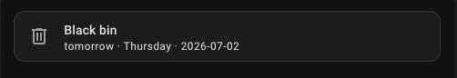
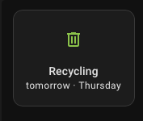

<p align="center">
  
</p>

# Lewisham Council Bin Collections — Home Assistant Integration

[](https://github.com/OliverFarren/lewisham-council-bins-home-assistant/actions/workflows/test.yml)
[](https://github.com/OliverFarren/lewisham-council-bins-home-assistant/actions/workflows/validate.yml)
[](https://codecov.io/gh/OliverFarren/lewisham-council-bins-home-assistant)
[](https://www.python.org/)
[](https://github.com/OliverFarren/lewisham-council-bins-home-assistant/releases/latest)

A [HACS](https://hacs.xyz) custom integration that retrieves household waste
collection schedules from [Lewisham Council's bin collection
service](https://lewisham.gov.uk/myservices/recycling-and-rubbish/your-bins/collection)
and adds them to Home Assistant. It is intended for residential addresses in
the London Borough of Lewisham.

This is an unofficial community integration and is not affiliated with or
endorsed by Lewisham Council. It relies on undocumented public endpoints that
may change without notice.

## Supported functionality

The integration creates one device for each configured address. Each waste
collection type returned by Lewisham Council, such as Food Waste, Recycling,
or Refuse, is represented by a sensor. These names come from the council
service and are not hard-coded by the integration.

### Sensors

Each sensor uses the date device class and reports the next collection date as
its state. For example, a sensor may have the state `2026-07-07`, which Home
Assistant displays as a date using the user's locale. The source of that date
differs by collection type, as explained below.

| Attribute | Description | Example |
| --- | --- | --- |
| `frequency` | The collection frequency reported by Lewisham Council. | `WEEKLY` or `FORTNIGHTLY` |
| `day` | The usual collection day reported by the council. | `Monday` |
| `next_collection_basis` | Indicates whether the next date was supplied by the council or calculated from the usual weekday. | `published` or `weekday_derived` |
| `source_url` | The council collection page associated with the retrieved data. | `https://lewisham.gov.uk/.../collection` |
| `fetched_at` | The date and time at which the integration received the schedule. | `2026-07-01T08:30:00+00:00` |
| `days_until_collection` | The whole-day difference between today and the next collection date. | `0` today, `1` tomorrow, or `4` in four days |
| `collection_in` | A relative label derived from `days_until_collection`. | `today`, `tomorrow`, or `4 days` |

#### How the next collection date is determined

In the residential schedule format currently returned by Lewisham Council,
Food Waste and Recycling are described as weekly collections with a usual
weekday. Refuse is described as fortnightly, followed by a single “Your next
collection date is” value. The council does not return a structured date for
each collection type; the client associates this one explicit date with
Refuse because of its position in the response.

- `published` normally appears on the fortnightly Refuse sensor. It means the
  date appeared explicitly in the council response and was associated with
  that collection.
- `weekday_derived` appears on weekly sensors such as Food Waste and Recycling.
  The client calculates the next occurrence of the council's stated weekday
  from the date on which the schedule was fetched. For example, if a schedule
  fetched on Tuesday says the usual collection day is Friday, the derived date
  is that Friday.

Together, these values provide the next dates for the normal residential
schedule: the council's explicit date identifies the next fortnightly Refuse
collection, while the stated weekday is sufficient for the weekly Food Waste
and Recycling collections.

Behaviour during bank holidays and other temporary schedule changes has not
been verified. Weekly dates derived from the usual weekday may not reflect
such changes, so check the council collection page when services are disrupted.

#### Choosing values for dashboards and automations

The values most likely to be useful are:

- The sensor state for the exact next collection date.
- `days_until_collection` for numeric conditions, such as sending a reminder
  when a collection is one day away.
- `collection_in` for a readable dashboard label such as `tomorrow`.

The `next_collection_basis` attribute serves a different purpose. It provides
provenance by showing whether the date appeared in the council response or was
calculated by the client. This may help explain discrepancies during bank
holidays, service disruptions, or other unusual collection schedules.

As a defensive fallback, a sensor is `unknown` if its collection type is
present in the latest response but no next date could be determined. This is
not expected for the normal residential schedule described above. A sensor is
`unavailable` instead when the schedule could not be refreshed or its
collection type has disappeared from the latest response.

Entity IDs are based on the collection type rather than the address, for
example `sensor.lewisham_council_bins_food_waste`. Unique IDs also include the
property's UPRN, allowing the same collection type to be added for more than
one address. Home Assistant may add a numeric suffix to avoid an entity ID
collision when multiple addresses are configured.

Each sensor gets a default icon based on its collection type: a food-waste
icon for Food Waste, a recycling icon for Recycling, a leaf for Garden Waste,
and a bin icon for Refuse or other rubbish streams. A collection type the
integration does not recognise still gets a sensor, with a generic bin icon.
Override any of these per entity from **Settings → Devices & services** if
you prefer a different icon.

The integration is read-only. It does not provide actions, controls, calendar
entities, or facilities for reporting missed collections.

## Use cases

- Display the next collection date for every collection type on a dashboard.
- Use `days_until_collection` or `collection_in` in an automation that reminds
  you to put bins out.
- Add more than one address to keep track of collections for relatives,
  neighbours, or another property in Lewisham.

## Languages

Alongside English, the setup screens and error messages are available in
Spanish, Tamil, Portuguese, Romanian, Italian, French, and Polish. These are
the most common languages spoken in the London Borough of Lewisham other than
English, according to the council's [Picture of Lewisham 2025](https://www.observatory.lewisham.gov.uk/wp-content/uploads/2025/09/Picture_of_Lewisham_2025_updated_September_2025.pdf)
report. Home Assistant selects a translation automatically based on your
configured language, falling back to English for any missing text.

## Examples

### Reminder the night before a collection

Bin day is easy to forget. This blueprint sends a notification the evening
before a collection, using any sensor from this integration. Add one
instance of the automation per bin you want a reminder for.

[](https://my.home-assistant.io/redirect/blueprint_import/?blueprint_url=https%3A%2F%2Fgithub.com%2FOliverFarren%2Flewisham-council-bins-home-assistant%2Fblob%2Fmain%2Fblueprints%2Fautomation%2Flewisham_council_bins%2Freminder.yaml)

[`reminder.yaml`](blueprints/automation/lewisham_council_bins/reminder.yaml)

### Dashboard tile cards

The `collection_in` and `day` attributes are designed to be used directly in
a Lovelace tile card's `state_content`, without setting up a template sensor
first. For example, a full-width card for the fortnightly refuse collection:

```yaml
type: tile
grid_options:
  columns: 12
  rows: 1
entity: sensor.lewisham_council_bins_refuse
name: Black bin
icon: mdi:trash-can-outline
color: grey
state_content:
  - collection_in
  - day
  - state
vertical: false
tap_action:
  action: more-info
features_position: bottom
```



And a narrower, vertical card for recycling:

```yaml
type: tile
grid_options:
  columns: 4
  rows: 1
entity: sensor.lewisham_council_bins_recycling
name: Recycling
icon: mdi:trash-can-outline
color: light-green
state_content:
  - collection_in
  - day
vertical: true
tap_action:
  action: more-info
features_position: bottom
```



## Prerequisites

- Home Assistant 2024.6 or newer.
- For the recommended installation method, a working
  [HACS](https://www.hacs.xyz/docs/use/) installation.

## Installation

### Setup parameters

- **Postcode or street name**: A Lewisham postcode or street search containing
  at least three non-whitespace characters. A full postcode generally produces
  the most precise results.
- **Address**: The property whose collection schedule you want to add. Select
  it from the search results; the integration stores its Unique Property
  Reference Number (UPRN) automatically.

### HACS (recommended)

1. In HACS, open the three-dot menu and select **Custom repositories**.
2. Enter
   `https://github.com/OliverFarren/lewisham-council-bins-home-assistant`,
   select **Integration** as the category, and select **Add**.
3. Find **Lewisham Council Bin Collections** in HACS and select **Download**.
4. Restart Home Assistant.
5. Go to **Settings → Devices & services** and select **Add integration**.
6. Search for and select **Lewisham Council Bin Collections**.
7. Enter a Lewisham postcode or street, select the matching address, and
   complete the setup.

### Manual installation

1. Copy `custom_components/lewisham_council_bins/` from this repository into
   the `custom_components/` directory in your Home Assistant configuration
   directory.
2. Restart Home Assistant.
3. Go to **Settings → Devices & services** and select **Add integration**.
4. Search for and select **Lewisham Council Bin Collections**.
5. Enter a Lewisham postcode or street, select the matching address, and
   complete the setup.

## Data updates

The integration retrieves the collection schedule during setup and whenever
Home Assistant starts. It then polls Lewisham Council every 12 hours. The
polling interval is intentionally fixed because collection schedules change
infrequently and the integration should avoid making unnecessary requests to
the council's undocumented endpoints.

The `days_until_collection` and `collection_in` attributes are recalculated at
local midnight without making an additional request to Lewisham Council.

If the first refresh fails during setup or startup, Home Assistant retries
setting up the config entry automatically. If a later scheduled refresh fails,
the sensors become unavailable and the integration tries again at its next
12-hour refresh. They become available again after a successful refresh.

## Known limitations

- This integration is specific to properties returned by Lewisham Council's
  address search and collection service. For other local authorities, or a
  broader multi-council project, consider the community-maintained
  [UK Bin Collection Data](https://github.com/robbrad/UKBinCollectionData)
  integration.
- The integration relies on undocumented public Lewisham Council endpoints.
  Changes to those endpoints may temporarily break address searches or
  collection updates. If the council collection page works but the integration
  continues to fail, follow the troubleshooting steps below and
  [open an issue](https://github.com/OliverFarren/lewisham-council-bins-home-assistant/issues)
  with redacted logs.
- Collection types are normally stable. If the council starts returning a new
  type for an address, reload the config entry once to create its sensor.

## Troubleshooting

### The search query is rejected

**Symptom:** Setup displays `Search query must be at least 3 characters.`

Enter at least three non-whitespace characters. Leading, trailing, and repeated
spaces do not count towards the minimum.

### No addresses are found

**Symptom:** Setup displays
`No addresses found. Try a different postcode or street name.`

1. Try the property's full Lewisham postcode rather than a partial street name.
2. Check whether the property is found on
   [Lewisham Council's collection service](https://lewisham.gov.uk/myservices/recycling-and-rubbish/your-bins/collection).

The integration can only offer addresses returned by the council's search
service.

### The integration cannot connect

**Symptom:** Setup displays `Failed to connect`, or existing sensors become
unavailable after an update failure.

1. Check that Home Assistant has internet access.
2. Check whether Lewisham Council's collection page is responding. The page
   and the endpoints used by the integration are separate, so a working page
   does not rule out a temporary endpoint failure.
3. Wait for Home Assistant to retry a failed initial setup. For an existing
   entry, the integration tries again at the next 12-hour refresh.
4. To try immediately, go to **Settings → Devices & services**, select
   **Lewisham Council Bin Collections**, open the three-dot menu next to the
   config entry, and select **Reload**.
5. If the problem continues, open **Settings → System → Logs** and search for
   `Lewisham` or `lewisham_council_bins`.

### Setup reports an unexpected error

**Symptom:** Setup displays `Unexpected error`.

Retry the search once in case the council returned a temporary malformed
response. If the error persists, check **Settings → System → Logs** as
described above. A persistent unexpected error may mean that the undocumented
council endpoints have changed.

### A sensor state is unknown

An `unknown` state means the collection type was returned but no next date
could be determined. This is not expected for a normal residential schedule.

Check the council collection page for the address. If it also has no usable
schedule information, the sensor will update when a later poll returns it. If
the page shows the normal collection details described above but the sensor
remains `unknown` after a reload, check the logs and open an issue.

### A collection type is missing

First check whether the collection type appears for the address on Lewisham
Council's collection page. If it does, reload the config entry using the steps
above. Sensors are created from the collection types available when the entry
is loaded.

If the collection type does not appear on the council page or in the response
used by the integration, reloading cannot create the sensor.

If a problem persists, [open an issue](https://github.com/OliverFarren/lewisham-council-bins-home-assistant/issues)
with the integration version, Home Assistant version, relevant log messages,
and steps to reproduce it. Redact your full address and UPRN from public issue
text and logs.

## Removal

1. Go to **Settings → Devices & services** and select
   **Lewisham Council Bin Collections**.
2. Open the three-dot menu for the address you want to remove and select
   **Delete**.
3. To uninstall the custom integration as well, remove it through HACS. For a
   manual installation, delete the
   `custom_components/lewisham_council_bins/` directory instead.
4. Restart Home Assistant after uninstalling the custom integration files.

## Development

```bash
uv sync --group dev
uv run pytest -v --cov=custom_components/lewisham_council_bins --cov-branch --cov-report=term-missing
uv run ruff check .
uv run mypy custom_components/lewisham_council_bins/
```

## Licence

MIT — see [LICENSE](LICENSE).
